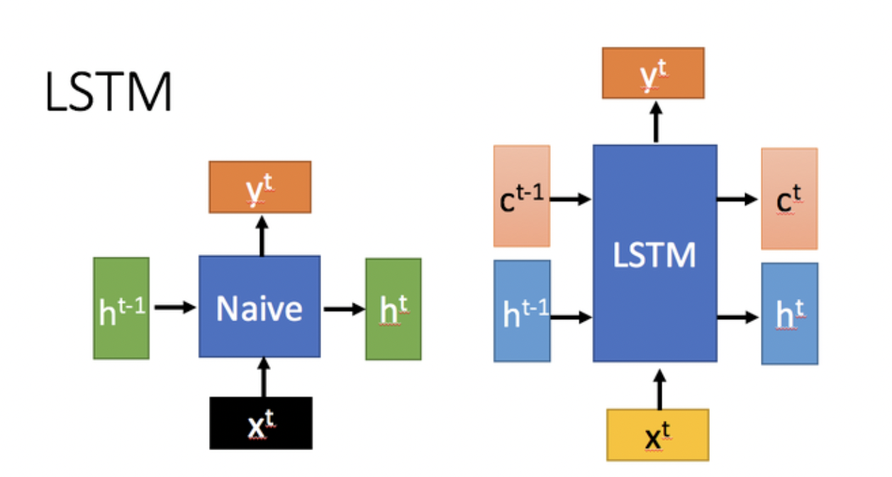
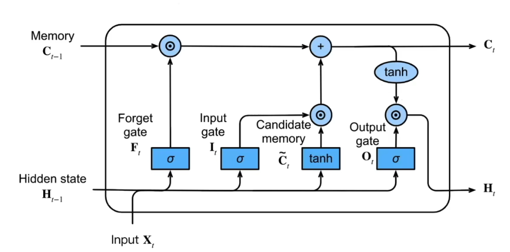

# 🤖 手搓**LSTM** -- 介绍与原理详解

## **💡什么是 LSTM**

**长短期记忆网络**（Long Short-Term Memory, **LSTM**）是一种特殊的循环神经网络（RNN），专门用于解决长序列训练中的梯度消失和梯度爆炸问题。与普通的 RNN 相比，LSTM 具有在处理长序列数据时更优异的性能，这得益于其独特的“记忆”机制。

由图中可以看到，**LSTM** 的核心特性在于它有了两种状态：**单元状态**（Cell State, $C_t$）和**隐藏状态**（Hidden State, $H_t$）。这种双状态的设计使得 LSTM 能够在更长时间跨度内保留重要信息，单元状态负责存储长期记忆信息，它类似于一条传送带，可以让信息几乎无损地从早期时间步传递到后期时间步。相比之下，传统的 RNN 仅依赖单一的隐藏状态 $H_t$ 来传递信息，这在处理长时间序列时常常力不从心。
> Tips：RNN中的 $h_t$ 在计算上对应于LSTM中的 $c_t$，这一点后面会说到

## **🛠️ 深入 LSTM 结构**
LSTM 的设计理念可以概括为：如何在**当前时间步输入**与**先前时间步状态**之间进行权衡，以更好地处理序列数据。下面，我们将深入剖析 LSTM 的内部结构，以理解其如何实现这一目标。
简单概括 **LSTM** 结构，它主要包括三个门控机制 + 记忆单元机制 + 隐状态

- **忘记门**：将值朝零减少
  
  $F_t = \sigma(X_t W_{xf} + H_{t-1} W_{hf} + b_f)$

  参数解释：这里的 $\sigma$ 是一个带激活函数的全连接层， $X_t$ 是当前时间步的输入， $H_{t-1}$ 是上一个时间步的隐藏状态， $W_{xf}$ 是遗忘门的权重矩阵， $b_f$ 是遗忘门的偏置向量，下面公式的参数意义与这里类似。
- **输入门**：决定是不是忽略掉当前时间步的输入数据
  
  $I_t = \sigma(X_t W_{xi} + H_{t-1} W_{hi} + b_i)$
- **输出门**：决定是否使用当前时间步的隐状态(`hidden state`)
  
  $O_t = \sigma(X_t W_{xo} + H_{t-1} W_{ho} + b_o)$

- **候选记忆单元**：

  $\tilde{C}\_t = \tanh(X_t W{xc} + H_{t-1} W_{hc} + b_c)$
  
  这个部分的计算和 RNN 中的 `hidden state` 计算是一致的，由当前时间步的输入与前一个时间步的隐藏状态一起计算得出，不涉及到任何门结构。

- **记忆单元**：
  
  $C_t = F_t \odot C_{t-1} + I_t \odot \tilde {C}_t$
  
  这是 LSTM 的核心结构，记忆单元的更新包括两个部分，接入遗忘门的上一个状态的记忆，同时加上接入输入门的当前的信息。

- **隐状态**：
  
  $H_t = O_t \odot \tanh(C_t)$
  
  记忆单元的计算涉及到两项相加，它的值可能会偏大一些，那这里将记忆单元通过一个 $\tanh$，将它的值放缩到(-1, 1)之间，然后接入到输出门上，这个输出门可以实现将隐状态重置或者保留。

下面这张图展示了所有的公式和结构，并且由此我们可以讨论一下 LSTM 内部的运作机制。

## **🔄 LSTM 内部运行的生命周期**

LSTM 内部主要有三个阶段：

- **忘记阶段**
  
  在这一阶段，LSTM 会选择性地“遗忘”上一时刻传递过来的输入信息，即对输入进行筛选，决定哪些信息需要保留、哪些信息需要舍弃。具体来说，通过计算得到的遗忘门控信号 $F_t$，控制上一时刻的状态 $C_{t-1}$ 中哪些信息被保留，哪些被遗忘。这个过程确保模型能够过滤掉不相关的信息，从而提高其长期依赖关系的处理能力。
  
- **选择记忆阶段**
  
  在这一阶段，LSTM 会对当前输入 $X_t$ 进行选择性“记忆”，即根据重要性来决定哪些新信息需要被添加到当前的记忆中。输入门控信号 $I_t$ 控制这一选择性记忆的过程。LSTM 使用 $\tilde {C}_t$ 表示潜在的候选记忆，通过输入门来调节新信息的存储。最终，将忘记阶段和选择记忆阶段的结果相加，得到当前时刻的记忆单元状态 $C_t$。
  
- **输出阶段**
  
  输出阶段决定当前时刻哪些信息将作为输出传递给下一个单元。LSTM 通过输出门控信号 $O_t$ 来调节输出内容。与此同时，当前时刻的记忆单元状态 $C_t$ 经过一个 $\tanh$ 激活函数进行非线性变换，以确保输出具有适当的范围。最终，隐藏状态 $H_t$ 是由输出门控信号调节的结果，并可以用于生成最终的输出 $Y_t$，从而维持与普通 RNN 类似的输出机制。

## **📝 小结**

**LSTM** 网络通过门控机制来实现对信息的筛选与控制，在处理长时间依赖问题时表现出色。它能够选择性地记住有用的信息，遗忘不重要的内容，而不像普通 RNN 那样仅有一种记忆叠加方式。**LSTM** 通过引入遗忘门、输入门、输出门和记忆单元，实现了对输入和过往状态的有效权衡。

**LSTM** 对很多需要"长期记忆"的任务来说尤其好用。但同时也因为引入了很多内容，导致参数变多，训练难度也加大了很多。

学习完这里的理论知识，我们可以开始手搓一个简单的 `lstm` 结构，在后面的代码实操中，我们将使用 `PyTorch` 来实现一个简单的 `LSTM` 模型，并且使用它来解决一个股票预测的问题。

到这里，第一阶段的学习任务已经完成了。学习者，接下来让我们开始实现一个最基础的 `LSTM` 模型吧！

[lstm 模型手搓实现传送门](./notebook/lstm.ipynb)

## **📚 课后问题**

- **RNN 模型梯度消失/爆炸的含义是什么？**
- **LSTM 真的能够解决梯度消失/爆炸问题吗？怎么解决的呢？**

**关于这些问题欢迎各位小伙伴在交流群内积极交流！**

## **📎 参考链接**

- [LSTM论文](https://www.bioinf.jku.at/publications/older/2604.pdf)
- [Dive into Deep Learning RNN章节](https://zh.d2l.ai/chapter_recurrent-neural-networks/rnn.html)
- [知乎关于LSTM的讨论](https://www.zhihu.com/question/44895610/answer/616818627)
