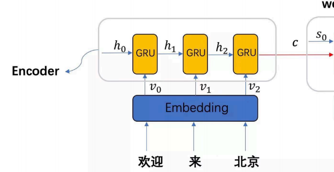
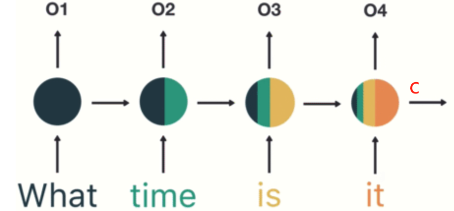

#  手搓一个Seq2Seq模型

在这个模块,将为大家详细讲解NLP入门必须要懂的Seq2Seq模型,注意力机制是什么以及如何将注意力机制融入到Seq2Seq模型中

## 模型分类

我们可以根据输入输出的结构来对传统NLP模型进行分类，大致可以分为以下四种类别：

1.  1 vs N
2.  N vs 1
3.  N vs N
4.  N vs M

其中，数字和字母表示模型输入或输出的词/字符数量。

他们分别对应的场景如下:

1. **1 vs N**（单输入，多输出）：文本生成(给一字,生成一篇对应主题的文章), 翻译任务(翻译一个词)
2. **N vs 1**（多输入，单输出）: 分类任务(给一段话,看看这段话输入什么类别)
3. **N vs N**（多输入，多输出）: 用来做古诗词续写(输入窗前明月光, 让模型输出下一句)
4. **N vs M**（多输入，多输出，长度不同）：这个就很通用了, 可用于文本生成, 翻译, 聊天对话等

我们现在用的最多的一类模型就是N vs M, 而Seq2Seq也就是这一类模型的典型代表之一。

## Seq2Seq介绍

Seq2Seq是一种多输入多输出的模型结构，适用于许多实际应用场景，是NLP领域最经典的模型之一。即使是在当前流行的Transformer框架中，我们依然能看到Seq2Seq的影子。下面是Seq2Seq的结构。

Seq2Seq结构

Seq2Seq由两个组件组成:

1. Encode层
2. Decode层

接下来我将为大家介绍这两个组件。

### Encode解码器

编码器负责将输入序列（例如，一句话的单词序列）逐步编码成一个固定大小的向量表示。编码器通常由一系列递归神经网络（如RNN,LSTM或GRU）层组成，逐个处理输入序列的元素，并通过隐藏状态来逐步积累上下文信息。最后一个隐藏状态包含了整个输入序列的信息，作为压缩后的输入序列表示，这一向量会传递给解码器。

Encode结构

如图所示，这是一个编码器结构，由嵌入层和循环神经网络组成。它的输入是一句话，输出为一个n维向量，用于表示该句子的语义。整个过程被称为编码，具体步骤如下：

1. 对句子进行分词。
2. 构建词汇表。
3. 将句子中的每个词转化为对应的词汇表序号。
4. 通过Embedding层将这些序号映射为向量。
5. 将向量输入到循环神经网络中进行信息提取。
6. 最后，输出一个隐藏状态编码 c，作为句子的语义表示。

下面是一个具体例子:

假设输入句子为“我爱学习”。

1. **分词**：将句子分成“我”、“爱”、“学习”。
2. **构建词汇表**：假设词汇表中“我”为1，“爱”为2，“学习”为3。
3. **转换为序号**：句子转化为序号序列1,2,3。
4. **Embedding映射**：通过Embedding层，将序号1,2,3映射为向量序列。
5. **循环神经网络**：将向量序列输入RNN/LSTM/GRU提取信息。
6. **生成编码**：得到的隐藏状态编码 c,  即为“我爱学习”的语义表示。

关于最后隐藏状态 c 所包含的语义，可以参考下图。最后的 c 就是包含句子 "what time is it" 的语义向量。

### Decode解码器

解码器的主要作用是根据目标生成我们期望的结果。它通过分析输入信息，逐步生成符合目标要求的输出内容，确保生成的结果与预期保持一致。结构如下:

Decode结构

解码器的输入包括三个部分：编码器最终生成的隐藏语义向量 ccc、开始符号的向量，以及初始化的中间语义。最终输出则是我们想要的目标结果。以图中示例为例，最终输出是句子 "欢迎来北京" 的英语翻译。整个过程称为解码。具体步骤如下：

1. 对输入句子进行编码，得到语义向量 c。
2. 构建一个输入起始符（例如，" |start|" 符号）。
3. 对起始符号进行Embedding处理。
4. 初始化一个中间语义 $S_0$。
5. 将中间语义和 c 拼接，得到整体的隐含语义输出。
6. 在每一步中，GRU 接收上一个时间步的输出、上一个时间步的中间语义，以及 c 拼接后的语义。
7. 最终，将每个步骤的输出拼接在一起，形成解码结果。

以上就是整个解码器的运作过程。

## 注意力机制

当我们观察事物时，之所以能快速做出判断（即便这种判断可能存在误差），是因为大脑能够迅速将注意力聚焦于事物最具辨识度的部分，而不是先全面观察事物的每个细节后才得出结论。正是基于这种机制，注意力机制理论应运而生。

这就像当你看到上面这幅图片时，第一眼吸引你注意的部分可能各不相同：有些人第一眼关注的是图中的角色，而另一些人则可能注意到其中的花朵。每个人的注意力机制都有其独特之处。而如何训练出我们期望的注意力机制（例如让所有人第一眼看到这张图片就关注到其中的角色）也是当前研究的一个重点方向。

注意力机制的计算公式多种多样，但最具代表性的是2017年论文《Attention Is All You Need》中提出的注意力计算公式。该公式凭借其强大的并行计算优势，从众多公式中脱颖而出，成为领域内的重要基石。

公式如下:

$$
\text{Attention}(Q, K, V) = \text{Softmax}\left(\frac{Q K^T}{\sqrt{d_k}}\right) V
$$

- **$Q$（Query）**：查询矩阵，用于代表当前单词的特征。
- **$K$（Key）**：键矩阵，代表序列中所有单词的特征。
- **$V $（Value）**：值矩阵，包含需要提取的信息。
- **$$d_k$$**：键矩阵$ K$ 的维度，用于缩放，避免数值过大导致梯度消失问题。
- **$Softmax$**：用于归一化，将结果转化为概率分布，以便加权求和。

下面的例子说明这个公式的作用:

可以把注意力机制的公式理解为一个“寻找最相关信息的过程”。想象一下，你在看一本书，而这本书的每一页上都有很多单词。但你在阅读时并不是每个单词都仔细看，而是会自动地把注意力集中在最重要的内容上，来快速理解书的核心思想。这个过程可以用注意力机制来形象地说明。

假设：

- **$Q$（Query）** 是你现在想了解的一个问题，比如“这本书的主要情节是什么？”
- **$K$（Key）** 是这本书每一页的内容摘要，表示书中每一页的信息。
- **$V $（Value）** 是这本书的实际内容。
- **$Softmax$** 就是你的大脑在每一页的摘要中找到与问题（Query）最相关的页面，并把注意力集中在这些页面上。

工作过程如下：

1. 你先带着“想知道主要情节”的问题（Query）去看书。
2. 你快速扫一眼每一页的摘要（Key），看看哪些摘要最符合你的问题。
3. 当你找到最相关的页面时，你的大脑会特别关注这些页面的实际内容（Value）。
4. Softmax 类似于你的大脑在权衡每一页的相关性，将注意力更多地分配给那些与你的问题高度相关的页面，而忽略不太相关的页面。

这样一来，通过注意力机制，你可以在不通读全书的情况下，快速抓住书中的主要情节。这就是注意力机制的基本工作原理：在一堆信息中，自动找到和问题最相关的部分，进而加以关注。

## 注意力机制与Seq2Seq的结合

以一个翻译场景为例，当我们翻译一段中文文本成英文时，通常只会关注中文句子中与当前翻译词相关的部分。比如在翻译“I”时，我们的注意力会集中在“我”这个词上；而当翻译“love”时，我们会关注“我爱...”的部分，以确定“love”的正确时态和语气。

如果在翻译“I”时，我们需要查看整句中文，可能会因为信息量过大而无法有效找出关键点，导致翻译不准确。类似地，机器翻译也存在这个问题。当模型在翻译某个词时，注意力机制能够动态调整解码器的关注焦点，确保它只关注与当前输出相关的输入部分。这不仅提升了翻译的准确性，还更好地保留了原句的语义。

在 Seq2Seq 模型中引入注意力机制时，首先需要明确 K（Key）、Q（Query）和 V（Value）的定义。以翻译任务为例，我们的目标是基于已翻译的内容和编码器中获取的上下文信息，动态地决定在翻译下一个词时该关注输入句子的哪些部分。

在这种情况下，Q、K 和 V的定义如下：

- **Query (Q)**：当前解码器的隐藏状态 $h_t$，它表示解码器当前时间步的状态。这个状态包含了模型到当前为止所生成内容的信息，即已翻译的历史信息。
- **Key (K)** 和 **Value (V)**：编码器的所有隐藏状态 ${h_1, h_2, ..., h_n}$。每个隐藏状态对应输入句子中每个词的编码信息，其中 Key用来计算注意力权重，Value是对输入句子内容的编码信息，在计算注意力后用于生成上下文向量。

解码器利用当前的 Query 与编码器的每个 Key（即每个隐藏状态）进行相似度计算$\text{Softmax}\left(\frac{Q K^T}{\sqrt{d_k}}\right)$，得到一组注意力权重。这些权重表示在翻译某个单词时，解码器应关注源句子每个位置的程度。例如，在生成“love”时，模型会分配更多的注意力到与“爱”对应的隐藏状态上，从而增强对这一部分内容的理解。

